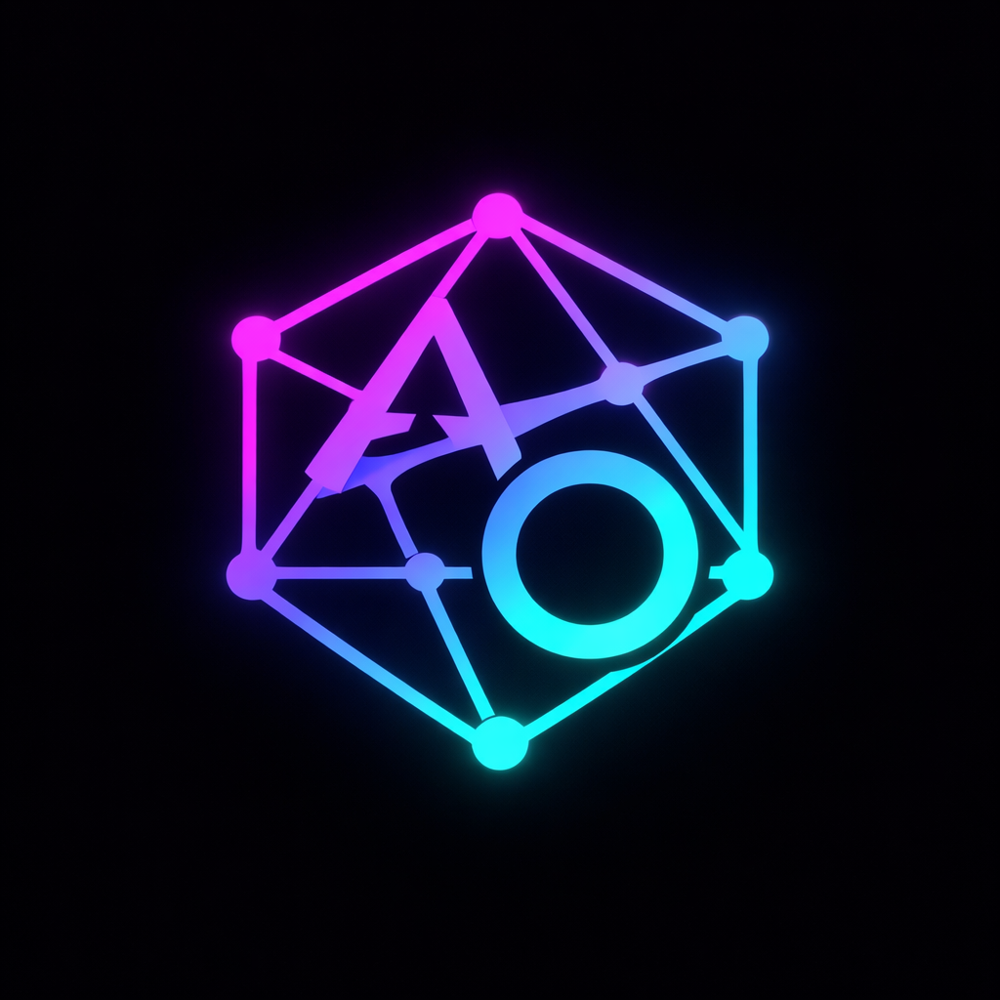

<div align="center">
  

  <h1>AitherOS</h1>

  <p><strong>The Operating System for Autonomous AI Teams</strong></p>

  <p>
    <a href="https://github.com/AitherLabs/AitherOS/releases"></a>
    
    
    
  </p>
</div>

---

AitherOS lets you build and run **autonomous AI teams** — not just chatbots, not just API wrappers. Real teams of specialized agents that plan together, share memory, use tools, and produce results through genuine coordination.

You define the team. They do the work.

---

## What it looks like

**The Floor** — a live virtual workspace showing every agent, what they're doing right now, and how they're connecting to each other. Not a log viewer. Not a dashboard full of charts. A room you can walk into and read at a glance.

**Workforces** — groups of agents with shared goals, shared tools, and shared memory. Each workforce gets its own isolated workspace, credential vault, task board, and knowledge base. Everything a real team needs.

**Executions** — missions with a planning phase, coordinated agent rounds, peer consultation, and a synthesis step. The orchestrator drives the agents; you watch it unfold in real time. Step in when you need to, let it run when you don't.

---

## Core Capabilities

### Multi-Agent Orchestration
Agents operate in coordinated rounds with a shared plan. The orchestrator handles scheduling, token budgets, deadlock detection, and synthesis — so agents can focus on their specialization instead of workflow management.

### Long-Term Memory
Every execution writes to a per-workforce vector knowledge base. The next time an agent runs, it draws on everything the team has learned. Memory compounds. Teams get smarter over time.

### MCP Tool Ecosystem
Every workforce ships with **Aither-Tools** — a built-in MCP server with 50+ tools covering filesystem, shell, git, web search, networking, secrets, kanban, and image generation. Add your own MCP servers alongside it. All provisioned automatically when a workforce is created.

### Image Generation
Agents can generate images natively — not by switching models, but by calling a `generate_image` tool that works with Google Imagen, OpenAI DALL-E, fal.ai, or any compatible provider. The orchestrator injects credentials from your provider configuration automatically.

### Real-Time Collaboration
The frontend connects via WebSocket. Every agent message, tool call, and status change appears live. Human-in-the-loop intervention — guidance, corrections, halts — is a first-class feature, not an afterthought.

### Secure Credential Vault
Per-workforce AES-256-GCM encrypted secrets. Agents access credentials through the `get_secret` tool at runtime — no hardcoded keys, no shared environment variables leaking across teams.

### Provider Flexibility
Connect any LLM provider through an OpenAI-compatible interface. Mix models within a single workforce — one agent on GPT-4o, another on Claude 3.5, a third on a local Mistral. Supports text, embedding, image, video, and audio model types.

---

## Architecture

```
┌─────────────────────────────────────────────┐
│                  Frontend                    │
│         Next.js · WebSocket · Real-time      │
└───────────────────┬─────────────────────────┘
                    │ HTTP + WebSocket
┌───────────────────▼─────────────────────────┐
│                  Backend (Go)                │
│  Orchestrator · Event Bus · Knowledge (RAG)  │
│  MCP Manager · Provider Registry · Store     │
└──────┬──────────────┬───────────────┬────────┘
       │              │               │
  PostgreSQL       Redis           MCP Servers
  + pgvector      pub/sub         (Aither-Tools
                                   + custom)
```

**Go backend** — orchestrator, API, event bus, RAG pipeline, MCP session management
**Next.js frontend** — live execution view, workforce management, agent debug console
**PostgreSQL + pgvector** — persistent state + vector similarity search for knowledge retrieval
**Redis** — real-time event pub/sub between orchestrator goroutines and WebSocket connections
**MCP (Model Context Protocol)** — tool layer; every workforce runs its own isolated tool server

---

## Self-Hosting

### Requirements

- Go 1.22+
- Node.js 20+
- PostgreSQL 16+ with the `pgvector` extension
- Redis 7+
- An LLM provider (OpenAI, Anthropic, Google, or any OpenAI-compatible endpoint)

### Quick Start

```bash
# 1. Clone
git clone https://github.com/AitherLabs/AitherOS.git
cd AitherOS

# 2. Configure
cp .env.example .env
# Edit .env — set POSTGRES_*, REDIS_*, JWT_SECRET, LLM_API_BASE, LLM_API_KEY

# 3. Apply database schema
psql $DATABASE_URL -f scripts/001_init.sql
# Apply any additional migrations in scripts/002_*.sql … 013_*.sql

# 4. Build the backend
cd backend && go build -o aitherd ./cmd/aitherd && cd ..

# 5. Build the frontend
cd frontend && npm install && npm run build && cd ..

# 6. Start
./backend/aitherd &
cd frontend && npm start
```

For production, PM2 manages both processes via `ecosystem.config.js`.

### Key Environment Variables

| Variable | Description |
|---|---|
| `POSTGRES_HOST` / `DATABASE_URL` | PostgreSQL connection |
| `REDIS_HOST` / `REDIS_URL` | Redis connection |
| `JWT_SECRET` | HS256 secret for session tokens |
| `ENCRYPTION_KEY` | 32-byte base64 key for credential vault |
| `LLM_API_BASE` | OpenAI-compatible LLM endpoint |
| `LLM_API_KEY` | API key for LLM provider |
| `EMBEDDING_API_BASE` | Embedding endpoint (for knowledge base RAG) |
| `NEXTAUTH_SECRET` | NextAuth session secret |
| `NEXTAUTH_URL` | Frontend public URL |

---

## What Teams Are Already Doing With It

- **Research teams** — agents that search, read, synthesize, and write reports across dozens of sources in parallel
- **Development squads** — planner, coder, reviewer, and tester agents that iterate on a codebase autonomously
- **Content studios** — writer, art director, and asset generator agents that produce campaigns end to end, including generated images
- **Data pipelines** — extract, transform, analyze, and summarize data from live sources
- **Support operations** — agents that triage, investigate, and draft responses with access to internal knowledge bases

---

## Roadmap

- **Virtual Office** — Gather.town-style 2D workspace where agent sprites move between rooms, animate when active, and show conversations as speech bubbles
- **Scheduled executions** — Autonomous mode with cron-triggered leadership reviews and recurring missions
- **Agent-to-agent messaging** — Direct peer consultation channels outside of execution rounds
- **Execution templates** — Save and reuse workforce configurations, plans, and playbooks
- **Webhooks & triggers** — Start executions from external events, Slack messages, or API calls

---

## Links

- **Website**: [aitheros.io](https://aitheros.io)
- **Issues**: [github.com/AitherLabs/AitherOS/issues](https://github.com/AitherLabs/AitherOS/issues)
- **Releases**: [github.com/AitherLabs/AitherOS/releases](https://github.com/AitherLabs/AitherOS/releases)

---

<div align="center">
  <sub>Built by <a href="https://aitheros.io">AitherLabs</a> · Self-hosted · Open Source</sub>
</div>
